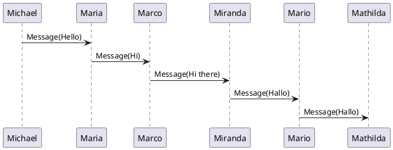

# コンポーネントリファレンス

このページでは、ブログで使用可能なコンポーネントのサンプルと使用方法を紹介しています。

**Astro Big Doc** では、Markdown をCMSとして使用し、Astroコンポーネントでレンダリングします。

## 目次
- [イメージコンポーネント](#イメージコンポーネント)
- [ギャラリー](#ギャラリー)
- [カード](#カード)
- [3Dモデルビューア](#3dモデルビューア)
- [テーブル](#テーブル)
- [ノート](#ノート)
- [詳細表示](#詳細表示)
- [コードブロック](#コードブロック)
- [リンク](#リンク)
- [ダイアグラム](#ダイアグラム)
- [リファレンス](#リファレンス)

## イメージコンポーネント

### 基本的な画像リンク
画像はパンズーム機能付きのモーダルビューで表示できるコンポーネントに包まれています。

```markdown

```

上記のコードは次の画像を生成します：


### 高度な画像ディレクティブ
より多くのオプションを提供するために、image ディレクティブを使用することで、マークダウンから追加の引数を渡すことができます。

```markdown
:image[]{src=./home/astro-markdown-render-small.png alt="Astro Markdown Render" height=200 center}
```

これにより、高さが調整された画像が生成されます。widthまたはheightのいずれかを指定しても、アスペクト比は保持されます。また、画像を中央に配置することも可能です。

:image[]{src=./home/astro-markdown-render-small.png alt="Astro Markdown Render" height=200 center}

### SVG画像


## ギャラリー

これはギャラリーAstroコンポーネントです。メタデータ'gallery'を持つYAMLコードブロックに画像のリストを提供することで、以下のようなギャラリーを生成できます：

``````
```yaml pz_gallery
- tree.svg
- gallery-tiger.svg
- gallery-long_diag.svg
- gallery-Linux_kernel_map.svg
- gallery-tiger.svg
- github-dark.png
```
``````

これにより、次のギャラリーが生成されます：

```yaml pz_gallery
- home/tree.svg
- home/images/gallery-tiger.svg
- home/images/gallery-long_diag.svg
- home/images/gallery-Linux_kernel_map.svg
- home/images/gallery-tiger.svg
- home/images/github-dark.png
```

## カード

YAMLコードブロックリストからカードを作成することも可能です。以下のリストでは、uidが既存の`markdown`または`markdown_card`形式のドキュメントを指しています：

``````
```yaml cards
-   uid: cards-body.card-1
    body: true
    width: 300
-   uid: cards-body.card-2
    body: true
    width: 300
```
``````

これにより、次のカードが生成されます：

```yaml cards
-   uid: cards-body.card-1
    body: true
    width: 300
-   uid: cards-body.card-2
    body: true
    width: 300
```

## 3Dモデルビューア

[Model Viewer](https://modelviewer.dev/)マークダウンプラグインを使用します。

モデルは https://modelviewer.dev/editor/ から取得しています。

### リンクからの3Dモデル表示
.glbファイルへのリンクを挿入するだけで表示できます：

```markdown
[Astronaut](./home/Astronaut.glb)
```

これにより、次の3Dモデルが生成されます：

[Astronaut](./home/Astronaut.glb)

### コードからの3Dモデル表示
コード言語として`yaml`とコードメタデータとして`glb`を使用した次のコードで表示できます：


これにより、提供されたファイルを使用して次の3Dモデルが生成されます：
* poster：ページの高速ロードのために、最初に画像のみをロードします。
* environment-image：照明効果用の画像

```yaml glb
src: ./home/Lantern.glb
title: Lantern
poster: ./home/Lantern.webp
environment-image: ./home/spruit_sunrise_1k_HDR.hdr
```

## テーブル

### マークダウン簡易テーブル

次のようなマークダウンテーブル：

```markdown
| Column 1 | Column 2 |
|----------|----------|
| Row 1    | Row 1 c2 |
| Row 2    | Row 2 c2 |
```

は、行数が少ないため、シンプルなテーブルビューになります：

| Column 1 | Column 2 |
|----------|----------|
| Row 1    | Row 1 c2 |
| Row 2    | Row 2 c2 |

### マークダウンデータテーブル

行数の多いテーブルには、フィルタリングとページネーション機能を持つ[data-table](https://datatables.net/)要素が使用されます：

| Name   | Age | City         |
|--------|-----|--------------|
| Johnny | 36  | New York     |
| John   | 30  | New York     |
| Jane   | 28  | Los Angeles  |
| Janny  | 22  | Los Angeles  |
| Marc   | 28  | Los Angeles  |
| Marco  | 21  | Bahamas      |
| Joanna | 29  | New York     |
| Joanna | 29  | Los Angeles  |
| Alice  | 32  | Miami        |
| Bob    | 27  | Seattle      |
| Clara  | 33  | Chicago      |
| Dave   | 24  | Houston      |
| Ella   | 26  | Atlanta      |

### XLSX テーブル

xlsx形式のテーブルも作成可能です。`.xlsx`拡張子のリンク：

```markdown
[Table1](./home/Table1.xlsx)
```

により、このデータテーブルが生成されます：

[Table1](./home/Table1.xlsx)

## ノート

ノートは次のように作成でき、マークダウンを内部に含めることができます：

```markdown
:::Note
## ノートタイトル
これはノートです
:::
```

これは次のように表示されます：
:::Note
## ノートタイトル
これはノートです
:::

複数のタイプがあります：Note, Tip, Caution, Danger

カスタムタイトルを付けることもできます：
```markdown
:::Tip{title="解決方法"}
これは非常に簡単です
:::
```

:::Tip{title="解決方法"}
これは非常に簡単です
:::

Caution（注意）：

:::Caution
十分に注意してください
:::

Danger（危険）：

:::Danger
ここには大きなリスクがあります
* ビルドが失敗する可能性がある
* エラーが継続する可能性がある
* デザインが誤っている可能性がある
:::

## 詳細表示

詳細を開閉ブロック内に隠すことも可能です：

```markdown
:::details{summary="詳細の要約..."}
隠す詳細
:::
```

これにより、次の詳細ブロックが生成されます：

:::details{summary="詳細の要約..."}
隠す詳細
:::

## コードブロック

コードブロックは、コード上にホバーすると表示される`コピー`ボタンを提供します。

JavaScript：
```js
const count = 0
console.log(count)
```

Python：
```python
for item in my_list:
  print(item)
```

## リンク

* 外部リンク：Astro Markdown Render [GitHubリポジトリ](https://github.com/MicroWebStacks/astro-markdown-render)は外部リンクで、新しいページで開きます。

* 内部リンク：[Panzoom](/examples/panzoom)エントリは同じページで開きます。

## ダイアグラム

コードからダイアグラムを生成するコンセプトです。これらのダイアグラムは、通常のビットマップやベクトル画像よりも自動化とLLM処理にはるかに役立ちます。

### Plantuml

これは[plantuml](https://plantuml.com/sequence-diagram)シーケンス図です：



## リファレンス

### シンプルなリファレンス

ページを参照する方法：

```markdown
Link to page::<page-uid>
Link to page::examples.svg-panzoom
```

これにより、次のようになります：

Link to page::examples.svg-panzoom

### ディープパスリファレンス

スラグはコンテンツタイプ内でのみ一意であるため、同じフォルダ名とタイトルを持つ複数のファイルがある場合、`index.json`で利用可能な自動生成された一意の識別子を使用できます：

```markdown
Link to page::<page-uid>
Link to page::deepest2.deepest3
```

これにより、パス`folder/trees/image-svg/readme.md`のアイテムへの正しいリンクが作成されます：

Link to page::deepest2.deepest3